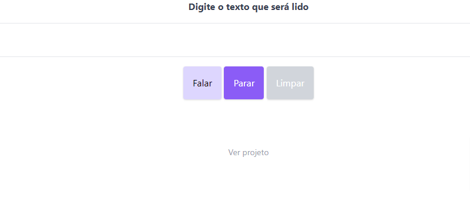

<h1 align="center">
  <strong>Text Reader JS</strong>
</h1>

  <a href="#-technologies">Technologies</a>&nbsp;&nbsp;&nbsp;|&nbsp;&nbsp;&nbsp;
  <a href="#-project">Project</a>

<h1 align="center">
    
</h1>

---

## 🧪 Technologies

This project was developed using the following technologies:

- [Speech Synthesis](https://developer.mozilla.org/pt-BR/docs/Web/API/SpeechSynthesis)
- [Tailwind](https://tailwindcss.com/)

## 💻 Project

Access the [Text Reader JS](https://text-reader-js.netlify.app/), copy and paste the text you want and enjoy! 🙂

---

## 👨🏻‍💻 Author

<h3 align="center">
  
   
  <strong>Elton Santos</strong> 🚀
   
   

 

  

 

Made with ❤️ by Elton Santos 👋🏽 [Entre em contato!](https://www.linkedin.com/in/eltonmelosantos/)

</h3>